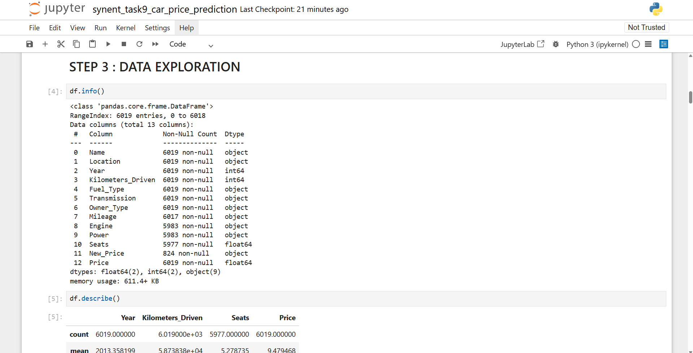
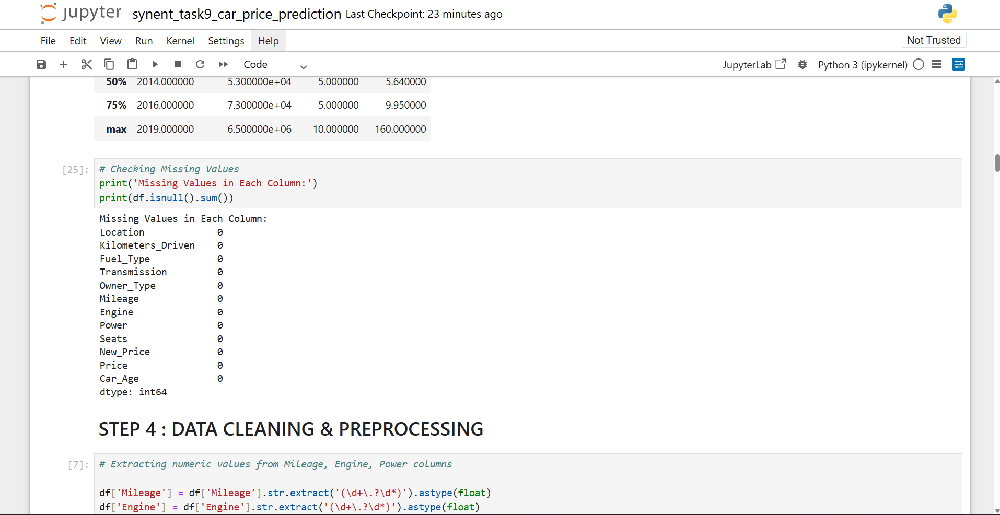
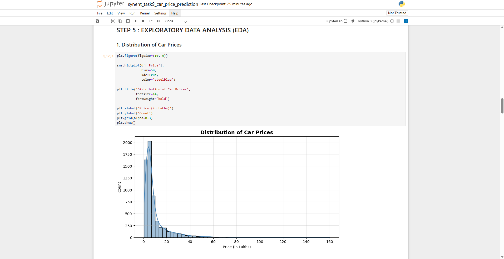
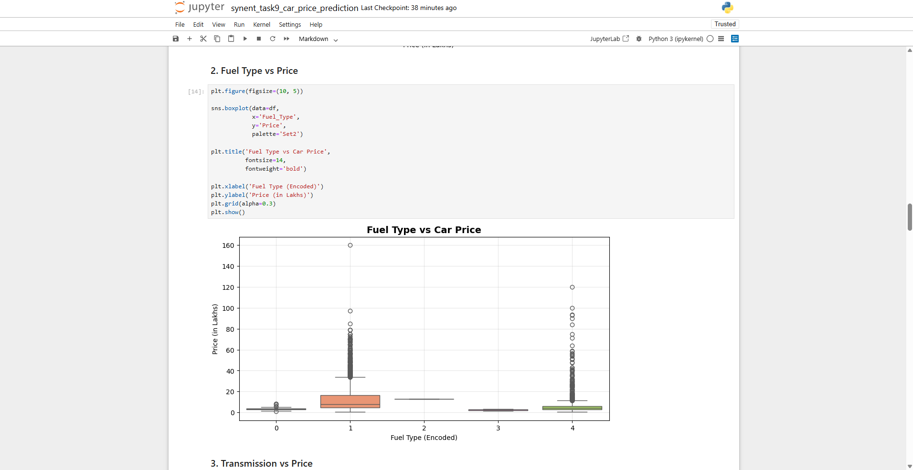
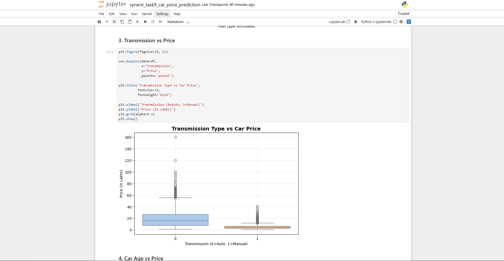
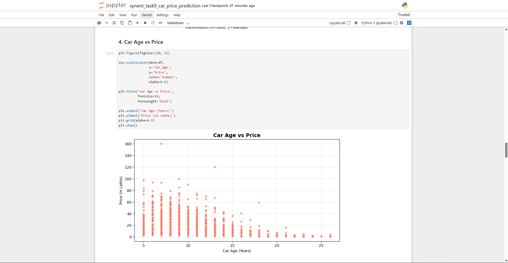
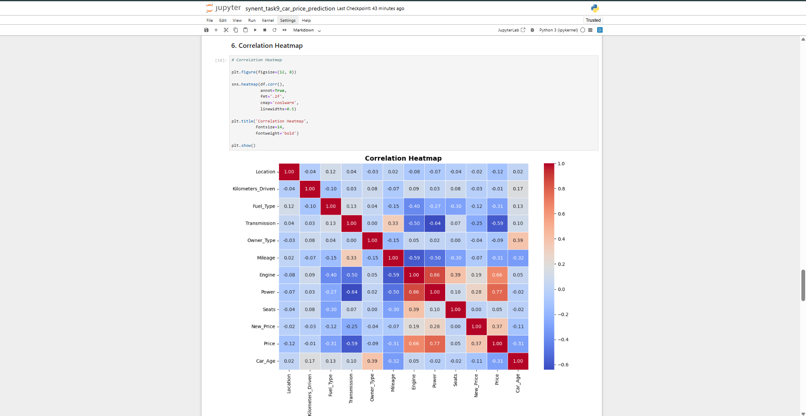
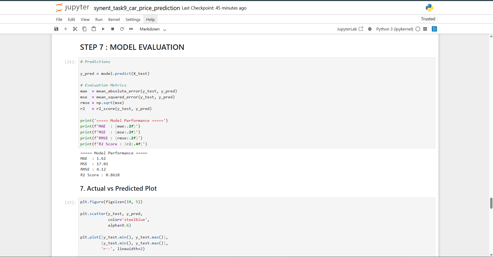
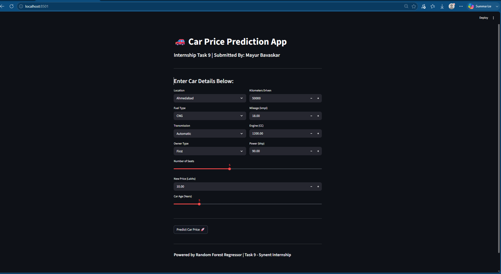

# 📊 USED CAR PRICE PREDICTION SYSTEM   
---

## 🚀 TASK 9 : END-TO-END DATA SCIENCE PROJECT

---

## 📌 PROJECT OVERVIEW

The objective of this project is to build a complete End-to-End Machine Learning project using a real-world Used Car Dataset.

This project includes:

- Data Collection  
- Data Cleaning  
- Exploratory Data Analysis (EDA)  
- Feature Engineering  
- Model Building  
- Model Evaluation  
- Deployment using Streamlit  

---

## 📂 DATASET DETAILS

- **Dataset Name:** Used Car Dataset  
- **Total Rows:** 6019  
- **Total Columns:** 13  

### 📌 Features Used:

- Name  
- Location  
- Year  
- Kilometers Driven  
- Fuel Type  
- Transmission  
- Owner Type  
- Mileage  
- Engine  
- Power  
- Seats  
- Price  

---

## 📸 SCREENSHOTS

### 📊 Dataset Overview

---

### 🧹 Data Cleaning & Missing Values

---

### 📊 Exploratory Data Analysis (EDA)

#### 💰 Car Price Distribution

#### ⛽ Fuel Type Count

#### ⚙️ Transmission Type

#### 📈 Year vs Price Analysis

---

### 🔥 Correlation Heatmap

---

### 🤖 Model Evaluation

---

### 🌐 Streamlit Home Page

---

## 🛠️ TECHNOLOGIES USED

- Python  
- Pandas  
- NumPy  
- Matplotlib  
- Seaborn  
- Scikit-Learn  
- Streamlit  

---

## 🤖 MACHINE LEARNING MODEL

### Algorithm Used:
- Random Forest Regressor  

---

## 🔄 PROJECT WORKFLOW

1. Import Libraries  
2. Load Dataset  
3. Data Understanding  
4. Handle Missing Values  
5. Data Cleaning  
6. Exploratory Data Analysis  
7. Feature Engineering  
8. Train Test Split  
9. Model Building  
10. Model Evaluation  
11. Save Model  
12. Streamlit Deployment  

---

## 📊 MODEL EVALUATION METRICS

- Mean Absolute Error (MAE)  
- R2 Score  

---

## 🚀 STREAMLIT DEPLOYMENT
Run this command:
streamlit run app.py

## PROJECT FEATURES

✔ Predicts Used Car Prices

✔ User Friendly Streamlit Interface

✔ Real-Time Prediction

✔ End-to-End Machine Learning Workflow

--------------------------------------------------

## CONCLUSION

This project successfully predicts used car prices using Machine Learning techniques.

The project demonstrates:

- Data Cleaning
- Data Visualization
- Machine Learning Model Building
- Deployment using Streamlit

This project helps understand how Machine Learning can be used in real-world automobile price prediction systems.

--------------------------------------------------

THANK YOU
